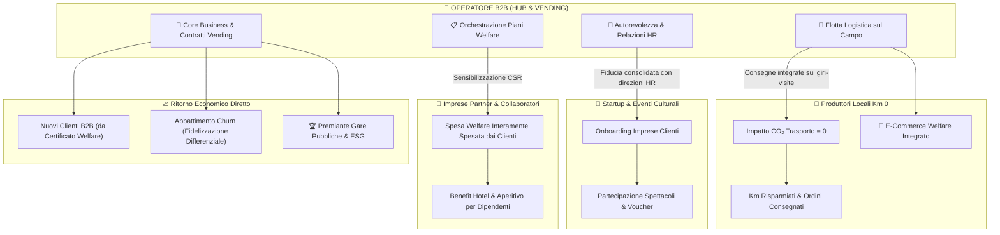

# 🏢 Promotore Welfare Territoriale: Ruolo dell'Operatore B2B & Piano Ristrutturazione Schede

Documento strategico e architetturale che analizza il ruolo sistemico dell'**Operatore B2B (Vending & Servizi)** nel circuito *Referral Vending × Welfare × Eventi*, definendo la scomposizione della scheda attuale e il completamento della nuova dashboard dedicata.

---

## 1. Diagnosi dell'Attuale Scheda "Output 5b"

L'attuale scheda (*"Impatto Commerciale B2B Vending & Dinamiche di Crescita"*) presenta criticità strutturali e visive:
1. **Asimmetria visiva e logica:** sulla sinistra è collocato un box ristretto con solo due righe di calcolo sintetico (*Nuovi Clienti B2B* e *Retention Clienti*), mentre sulla destra sono compressi due grafici eterogenei (*Crescita Referral Welfare* e *Composizione Valore*).
2. **Compressione grafica:** lo spazio per il grafico a ciambella (*PieChart*) e il grafico a barre/linea (*ComposedChart*) è ridotto ad appena la metà della larghezza desktop, causando sovrapposizione di etichette e troncamento delle legende.
3. **Sottorappresentazione del valore sistemico:** l'operatore B2B non è un semplice beneficiario passivo di contratti di distributori automatici, ma il **partner cardine che abilita l'intero ecosistema**. Ridurlo a due voci numeriche ignora il suo apporto logistico, relazionale e di orchestrazione territoriale.

---

## 2. Ruoli, Responsabilità e Valori Impliciti dell'Operatore B2B

### Le 4 Dimensioni del Valore dell'Operatore B2B:

1. **La Flotta Logistica come Infrastruttura Green per i Produttori Km 0:**
   * I piccoli produttori locali non dispongono di una rete di consegna capillare né dei volumi per giustificare spedizioni dedicate alle singole aziende.
   * L'operatore vending dispone già di una flotta commerciale e tecnica che visita regolarmente le imprese clienti per il rifornimento e la manutenzione dei distributori.
   * Veicolando i panieri di prodotti locali attraverso i propri giri-visite già programmati, **l'impatto ambientale da trasporto su gomma viene azzerato**, azzerando al contempo i costi di spedizione per i coltivatori.

2. **Autorevolezza & Gateway Commerciale per la Startup:**
   * La Startup e i promotori culturali territoriali non avrebbero la forza commerciale né l'autorevolezza istituzionale per accedere autonomamente ai vertici HR e agli uffici acquisti delle medie e grandi imprese.
   * L'operatore B2B funge da **garante di affidabilità**, introducendo la piattaforma come estensione ad alto valore del proprio servizio di ristoro aziendale.

3. **Orchestratore del Welfare (Spesato Interamente dai Clienti):**
   * L'operatore non si fa carico del costo dei voucher: stimola e guida le proprie aziende clienti a stanziare budget welfare (spese CSR) a beneficio dei loro dipendenti, generando domanda diretta per il settore turistico, ricettivo ed enogastronomico locale.

4. **Tutela del Core Business & Nuova Pipeline Commerciale:**
   * *Nuovi Clienti:* contratti stipulati grazie al passaparola dei dipendenti che esibiscono il *Certificato di Partecipazione & Welfare* a datori di lavoro di aziende terze.
   * *Abbattimento Churn:* aumento della fedeltà contrattuale (dal Churn AS-IS 10% al Churn TO-BE 2%), rendendo il servizio vending insostituibile rispetto a concorrenti basati sul solo prezzo della bevanda.

---

## 3. Piano di Riorganizzazione in Due Schede Distinte

La scheda 5b viene scissa in **due componenti di primo piano**:

### 📊 Scheda 1: Dinamiche di Crescita & Analisi Grafica del Valore
*Posizionata dopo i moduli di output analitico, a larghezza piena:*
* **Grafico 1: Evoluzione dei Cicli Referral Welfare (ComposedChart)**
  * Spazio raddoppiato (h-72), barre per i nuovi partecipanti del ciclo e linea di tendenza per il cumulativo.
  * Tooltip personalizzato in tema *Dark Glass* e indicatori ausiliari (K-Factor, cicli di saturazione, moltiplicatore).
* **Grafico 2: Composizione del Valore Ecosistemico (Donut PieChart)**
  * Layout ottimizzato con ciambella proporzionata e **legenda tabellare laterale/inferiore** con valori in euro, percentuali e badge colorati (`#2563eb`, `#38bdf8`, `#1d4ed8`, `#60a5fa`, `#0284c7`), senza etichette sovrapposte.

---

### 💼 Scheda 2: Cruscotto Strategico Operatore B2B — Promotore Welfare Territoriale
*Pannello completo a 4 sezioni che formalizza l'intero perimetro d'azione dell'impresa:*

#### Sezione 1: Ritorno Economico Diretto Vending
* **Nuovi Contratti Acquisiti:** calcolati dal funnel del Certificato Welfare esibito all'HR (+ `stats.valoreNuoviClienti`). *Nota strategica:* Questo valore numerico nel simulatore è volutamente conservativo e sottostimato; il vero volano non è solo il referral spontaneo, ma la facoltà per l'operatore di presentare **proposte dirette a grandi imprese**. Per tali aziende, infatti, il costo di adesione è quasi irrilevante a fronte di un altissimo valore di esperienza erogato ai dipendenti. Grazie a questa potente leva di Corporate Social Responsibility (CSR), le proposte commerciali dirette incontrano resistenze minime, disinnescando la classica guerra di prezzo sui prodotti da distributore.
* **Protezione Portafoglio & Churn Differenziale:** valore delle imprese fidelizzate con Δ Churn (`churnRateAsIs`% → `churnRateToBe`%, + `stats.valoreRetention`).
* **Totale Ritorno Diretto B2B:** sommatoria netta per il core business (+ `stats.totaleValoreB2B`).

#### Sezione 2: Flotta Logistica & Impatto Ambientale Azzerato (Km 0)
* **Logistica a Emissioni Zero:** la flotta del distributore assorbe le consegne Km 0 nei percorsi ordinari di rifornimento.
* **Km Logistica Evitati:** tratte su gomma convenzionali non percorse (+ `stats.kmLogisticaEvitati` km).
* **CO₂ Risparmiata:** emissioni climalteranti evitate (+ `stats.co2RisparmiataKg` kg CO₂).
* **Valore Sbloccato per i Produttori:** ordini e fatturato erogato alla filiera agricola locale (+ `stats.fatturatoProduttoriKmZero`).

#### Sezione 3: Autorevolezza, Gateway & Orchestrazione Welfare
* **Accreditamento Startup:** l'operatore introduce la Startup alle direzioni HR delle imprese clienti (`stats.impreseCoinvolte` aziende mobilitate).
* **Budget Welfare Mobilitato:** volume economico interamente spesato dalle imprese partner a favore dei dipendenti (+ `stats.spesaImpresePartner`, con ripartizione Hotel e Food).
* **Comunità Raggiunta:** dipendenti diretti e famiglie partecipanti attivati dall'orchestratore (`stats.totalePersoneRaggiunteWelfare`).

#### Sezione 4: Posizionamento ESG & Differenziazione Competitiva
* **Trasformazione del ruolo:** da fornitore di commodity a partner strategico ESG e coinvolgimento delle grandi imprese nella Value Proposition abilitata dal Welfare Aziendale.
* **Barriera d'ingresso competitiva e punteggio premiante nei criteri ESG nei contratti pubblici con gli enti locali.**
* **Promozione delle vendite Filiera Km 0 nello Store e-commerce della piattaforma di erogazione Welfare.**

---

## 4. Specifiche di Implementazione Tecnica

* File principale interessato: [`src/App.tsx`](file:///c:/Users/user/Desktop/Simulatore%20Referral%20Vending%20%C3%97%20Welfare%20%C3%97%20Eventi%20(v2)/src/App.tsx).
* Adozione integrale dei token di stile definiti in [`Design.md`](file:///c:/Users/user/Desktop/Simulatore%20Referral%20Vending%20%C3%97%20Welfare%20%C3%97%20Eventi%20(v2)/Design.md): `.glass-panel`, `.glass-panel-subtle`, `.glass-well`, `.glass-pill`.
* Coerenza cromatica: accenti in *Electric Blue* (`#3b82f6` / `#60a5fa`) e trasparenze scure ad alto contrasto.
