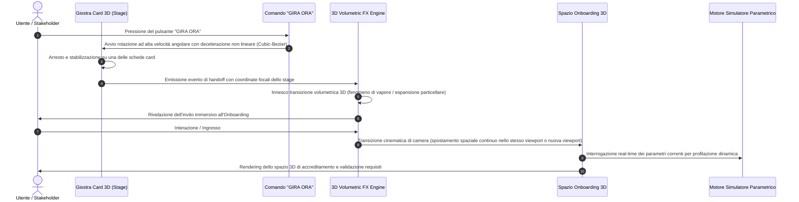

# 🌐 Skill: Onboarding 3D Ecosystem & Immersive Experience Engine

> **Documento Tecnico**: *Specifiche per l'Agente di Sviluppo & Architettura di Sistema*  
> **Nome Modulo**: `Onboarding`  
> **Trigger Primario di Attivazione**: Azione dell'utente sul pulsante **"GIRA ORA"** della giostra / carosello 3D.  
> **Sistemi di Riferimento Connessi**:
> 1. **Motore Parametrico del Simulatore** (Modello analitico, K-Factor, TUIR, CAM/CSRD, Scope 3, economie di scala).
> 2. **Stage di Presentazione delle Card 3D** (Orbita prospettica, micro-interazioni spaziali, dinamica dei benefit).

---

## 1. Visione di Sistema e Principio di Astrazione

Questa specifica non impone vincoli grafici rigidi, gabbie cromatiche statiche né layout prefissati. Il suo obiettivo è definire i **paradigmi computazionali, le tecnologie di rendering tridimensionale e i flussi dati** necessari per trasformare l'iscrizione all'ecosistema in un'esperienza interattiva memorabile.

L'ambiente di **Onboarding** non è concepito come un modulo anagrafico tradizionale, bensì come uno **spazio tridimensionale reattivo** in cui ciascuna categoria di partecipante sperimenta visivamente e matematicamente il proprio posizionamento all'interno del circuito di welfare territoriale.

---

## 2. Pipeline di Attivazione & Cinematic Handoff ("GIRA ORA")

L'accesso alla pagina/ambiente di Onboarding deve essere rigidamente sincronizzato con l'evento di estrazione della giostra:



### Regole Tecniche di Handoff:
1. **Aggancio Event-Driven**: Il modulo di Onboarding deve ascoltare l'evento di arresto del ciclo di spin della giostra. Non devono verificarsi attivazioni spurie o transizioni prima che la decelerazione fisica della ruota si sia conclusa.
2. **Continuità Spaziale**: L'origine della transizione scenica deve scaturire dal punto focale della scheda selezionata dalla giostra, preservando la coerenza prospettica dell'utente.
3. **Graceful Fallback**: In assenza di supporto GPU avanzato o con preferenze utente di accessibilità (`prefers-reduced-motion`), la pipeline deve degradare elegantemente verso una transizione di camera ortografica o dissolvenza fluida, senza perdere la sincronizzazione con i dati.

---

## 3. Tecnologie 3D Rilevanti & Paradigmi di Rendering

L'agente di sviluppo deve fare leva sulle tecnologie più performanti del panorama Web moderno per garantire fluidità a **60-120 FPS** anche sotto carico computazionale:

### 3.1 WebGL 2.0 / WebGPU & Pipeline Grafica
- **Librerie di Riferimento**: `Three.js`, `Babylon.js` o shader nativi GLSL/WGSL.
- **Rendering Pipeline**: Sfruttamento di pipeline a rendering differito (*deferred shading*) o *forward+* per la gestione di molteplici sorgenti luminose puntiformi e volumetriche.
- **Instanced Mesh Acceleration**: Utilizzo di geometrie istanziate per renderizzare sciami di elementi particellari e componenti tridimensionali con un singolo draw call alla GPU.

### 3.2 Shader Volumetrici & Simulazione di Fluidodinamica
- **Volumetric Raymarching**: Rendering del vapore/fumo mediante shader volumetrici basati su funzioni di rumore tridimensionale (*Simplex Noise*, *Perlin FBM*). La densità ottica deve rispondere dinamicamente all'illuminazione ambientale e alla profondità di campo.
- **Coalescenza Magnetica Particellare**: Implementazione di un sistema di particelle GPU (calcolate tramite compute shader o texture float) in cui le particelle sono governate da vettori di velocità, turbolenza e campi di attrazione magnetica che guidano la formazione di elementi grafici e testuali.
- **Displacement Mapping & Vettorialità**: Applicazione di filtri dinamici di distorsione per simulare moti convettivi e gradienti termici.

### 3.3 Modellazione Parametrica & Materiali PBR (Physically Based Rendering)
- **Materiali a Trasmissione Fisica**: Utilizzo di shader PBR avanzati con parametri di rifrazione (*IOR*), dispersione interna (*subsurface scattering*), rugosità variabile e trasparenza vetrosa per creare modelli tridimensionali tangibili.
- **Morphing Geometrico e Cromatico**: Supporto all'interpolazione in tempo reale di vertici (*morph targets*) e proprietà fotometriche del materiale per consentire alla scena di adattarsi istantaneamente al mutare del profilo utente.
- **Simulazione Dinamica di Superficie**: Texture procedurali animate per simulare superfici liquide, cremosità o flussi energetici all'interno degli elementi tridimensionali cardine.

### 3.4 Camera Splines & Cinematic Depth
- **Cinematic Interpolation**: Movimenti di camera calcolati tramite curve di Bézier tridimensionali o spline Catmull-Rom per guidare l'attenzione dell'utente durante il passaggio tra le varie fasi di accreditamento.
- **Post-Processing Stack**: Bloom calibrato per le emissioni di luce calda, aberrazione cromatica sottile ai bordi del viewport e anti-aliasing temporale (TAA o FXAA) per eliminare artefatti geometrici.

---

## 4. Architettura Concettuale dell'Ambiente di Onboarding

Lo spazio di Onboarding si struttura attorno a tre pilastri funzionali:

```
+----------------------------------------------------------------------------------------------------+
|                                    SPAZIO ONBOARDING 3D                                            |
+------------------------------------+-------------------------------+-------------------------------+
| 1. PROFILATORE SPAZIALE            | 2. MODELLO 3D ATTIVO          | 3. CALCOLATORE & ACCREDITAMENTO|
| - Grandi Imprese & Direzioni HR    | - Geometria tridimensionale   | - Calcolo istantaneo del      |
| - Addetti Imprese Clienti          |   principale ad alta          |   ritorno economico/ESG       |
| - Produttori Filiera Km 0          |   interattività spaziale      | - Requisiti di conformità     |
| - Attività Ricettive & Food        | - Morphing cromatico/materiale| - FAQ multi-stakeholder       |
| - Operatori Culturali & Eventi     | - Controllo orbitale 360°     | - Modulo di candidatura       |
+------------------------------------+-------------------------------+-------------------------------+
```

### 4.1 Differenziazione Funzionale dei Profili
Il sistema deve prevedere percorsi dedicati per ciascun attore dell'ecosistema, modulando la logica e le visualizzazioni:

1. **Grandi Imprese & Direzioni Risorse Umane**:
   - *Ambito*: Ottimizzazione dei piani welfare, welfare aziendale deducibile (art. 51 TUIR), retention del capitale umano, rendicontazione non finanziaria (ESG/CSRD).
   - *Focus Tecnico*: Assenza di canoni di piattaforma, attivazione di touchpoint di sostenibilità sul posto di lavoro, promozione dell'adesione dell'azienda.
2. **Addetti delle Imprese Clienti (Personale Dipendente)**:
   - *Ambito*: Accesso a benefit reali (soggiorni, ristorazione, spettacoli), consegna delle produzioni di qualità direttamente sul posto di lavoro.
   - *Focus Tecnico*: Registrazione con matricola/email, fruizione dei voucher, zero spese di trasporto per i prodotti territoriali.
3. **Produttori Agricoli di Prossimità (Filiera Corta a Km 0)**:
   - *Ambito*: Canale di sbocco commerciale diretto ad alto valore aggiunto, disintermediazione rispetto alla GDO, prezzo pieno garantito.
   - *Focus Tecnico*: Logistica condivisa con la flotta dei distributori, tratte dedicate azzerate, rendicontazione Scope 3 GHG certificabile.
4. **Strutture Ricettive, Agriturismi & Ristoratori**:
   - *Ambito*: Occupazione e consumo nei periodi infrasettimanali, disintermediazione dalle commissioni predatorie delle piattaforme OTA, moltiplicatore d'indotto per accompagnatori.
   - *Focus Tecnico*: Liquidazione rapida e garantita dei voucher, contingenti concordati.
5. **Operatori Culturali, Teatri, Festival & Startup**:
   - *Ambito*: Ampliamento del pubblico, attivazione del fondo Matching Grant per la copertura dei biglietti omaggio, viralità virata da passaparola (K-Factor).
   - *Focus Tecnico*: Co-finanziamento garantito, misurazione dell'impatto economico territoriale.

---

## 5. Connessione Reattiva con il Simulatore Parametrico

L'Onboarding non deve operare come silo isolato, ma deve collegarsi in tempo reale al **motore matematico del progetto**:

### 5.1 Flusso Dati Bidirezionale
- **Lettura dei Parametri**: La pagina deve poter leggere le variabili correnti impostate nel simulatore (es. volume imprese, dipendenti per azienda, frequenza di consumo Km 0, tassi di adesione, moltiplicatore turistico 2.5×).
- **Proiezioni Istantanee Personalizzate**: Ciascun profilo di onboarding deve includere un micro-simulatore reattivo che calcola in tempo reale il vantaggio specifico:
  - Per l'impresa: monte deducibilità fiscale annua e indice di retention del personale.
  - Per l'addetto: valore lordo annuo dei benefit esperienziali e risparmio sulle spese di consegna.
  - Per l'agricoltore: fatturato diretto stimato e chilometri di trasporto evitati.
  - Per la struttura ricettiva: volume d'affari diretto generato e commissioni OTA risparmiate.
- **Ritorno al Simulatore**: L'utente deve poter passare liberamente dallo spazio di Onboarding alla vista completa del Simulatore per verificare le formule e i bilanci complessivi.

---

## 6. Linee Guida di Implementazione per l'Agente di Coding

### 6.1 Performance Budget & Efficienza Computazionale
- **Texture Streaming & Compressione**: Utilizzare texture compresse o procedurali per minimizzare il consumo di memoria VRAM.
- **Framerate Stabile**: Garantire che il loop di animazione utilizzi `requestAnimationFrame` con delta time per scongiurare disallineamenti di fisica su monitor ad alto refresh rate (120Hz/144Hz).
- **Garbage Collection Optimization**: Evitare l'allocazione continua di oggetti (es. `new THREE.Vector3()`) all'interno del render loop; riutilizzare strutture dati e vettori statici pre-istanziati.
- **Clean Disposal**: Quando l'utente esce dalla pagina o torna al carosello, invocare metodicamente il dispose di geometrie, materiali, texture e canvas contexts per evitare memory leak.

### 6.2 Integrazione con Strumenti MCP
L'agente può orchestrare lo sviluppo e la validazione appoggiandosi ai server MCP presenti nell'ambiente:
- **`google-developer-knowledge`**: Consultazione di standard W3C WebGPU, pattern WebGL performanti e linee guida di accessibilità.
- **`visualization`**: Renderizzazione di grafici sintetici o anteprime numeriche da incorporare nei dossier di ammissione.
- **MCP Database / Cloud**: Gestione delle chiamate a endpoint dedicati alla validazione e memorizzazione delle candidature.

---

## 7. Criteri di Accettazione e Verifica Qualità

L'implementazione dell'Onboarding sarà considerata conforme se soddisfa i seguenti requisiti:
1. [ ] **Trigger Gira Ora Connesso**: L'effetto transizionale si attiva rigorosamente in corrispondenza dell'arresto del comando "GIRA ORA" della giostra.
2. [ ] **Profondità Tecnologica 3D**: Presenza di elementi tridimensionali interattivi basati su WebGL/Three.js/Shader (non semplici immagini piatte o illustrazioni statiche).
3. [ ] **Copertura Totale dei 5 Attori**: Requisiti, vantaggi e FAQ chiaramente distinti e navigabili per tutte le categorie di stakeholder.
4. [ ] **Calcolo Reattivo Integrato**: Presenza di micro-calcolatori di impatto collegati ai parametri algebrici del progetto.
5. [ ] **Navigazione Senza Attrito**: Doppia possibilità di rientrare sia al carosello delle 8 Card 3D, sia al Simulatore matematico principale.
6. [ ] **Build Pulita**: Compilazione ed esecuzione prive di errori di sintassi, con piena compatibilità desktop e mobile.
