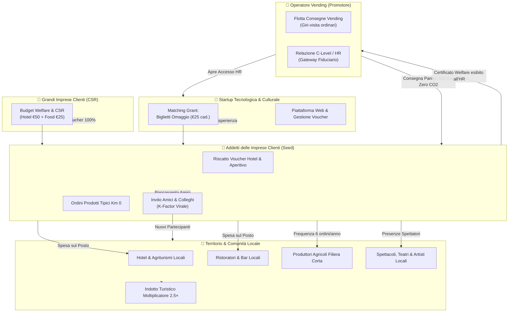

# 📑 PDR Key Features: Simulatore Referral Vending × Welfare × Eventi

> **Product Design Requirements & Technical Specification**  
> **Titolo Applicazione**: *Simulatore Welfare: Metriche di Diffusione & Impatto Territoriale Integrato*  
> **Sottotitolo**: *Modellazione delle sinergie con Matching Grant di Biglietti, Welfare Aziendale, Eventi, Attività Ricettive e Qualificazione e Valorizzazione della Filiera Km 0.*  
> **Versione**: 2.0-Enterprise  
> **Ambiente**: React 18, TypeScript, TailwindCSS, Lucide Icons, Recharts, Vite  
> **Target Utenti**: Direzioni Generali Operatori Vending, HR & CSR Manager di Grandi Imprese, Fondazioni Territoriali, Startup Culturali, Amministrazioni Pubbliche Locali.

---

## 1. Visione di Progetto e Posizionamento Strategico

### 1.1 Il Paradigma Tradizionale (AS-IS)
Il mercato della distribuzione automatica (Vending B2B) è storicamente afflitto da:
- **Commoditizzazione del servizio**: la competizione tra operatori si gioca quasi esclusivamente sulla riduzione del prezzo a tazzina (€/cialda o canone di noleggio distributore).
- **Elevato Churn Rate fisiologico (10% annuo)**: le aziende clienti cambiano frequentemente fornitore al termine dell'ammortamento dei macchinari o in presenza di offerte concorrenti con sconti marginali.
- **Micro-logistica separata e inefficiente**: i produttori locali agroalimentari a Km 0 faticano a distribuire piccoli lotti verso i luoghi di lavoro a causa degli elevati costi di trasporto su gomma e dell'impronta di carbonio.

### 1.2 La Trasformazione Sistemica (TO-BE)
Il presente progetto ridefinisce l'operatore vending da semplice fornitore di somministrazione a **Hub e Promotore del Welfare Territoriale**:
1. **Aggregatore di Valore ESG**: L'operatore propone alle grandi imprese clienti un programma di Welfare Aziendale finanziato tramite i budget CSR già deducibili dell'azienda cliente.
2. **Backbone Logistico a Emissioni Zero**: I furgoni tecnici dell'operatore, che già visitano settimanalmente le imprese per rifornire e sanificare i distributori automatici, consegnano anche i panieri di prodotti locali Km 0 ordinati dai dipendenti, **azzerando i costi di consegna e le emissioni $\text{CO}_2$ da trasporto dedicato**.
3. **Gateway Fiduciario per la Cultura**: La Startup convenzionata non ha accesso diretto ai consigli di amministrazione delle grandi aziende; l'operatore agisce da porta d'ingresso autorevole, mentre la Startup co-finanzia l'iniziativa erogando **Biglietti Omaggio in Matching Grant** per spettacoli ed eventi del territorio.
4. **Elevata Barriera all'Uscita e Fidelizzazione Attiva**: Quando il servizio di ristoro aziendale è integrato con i benefit per il personale e la filiera territoriale a Km 0, cambiare operatore promotore vending comporterebbe la revoca del programma welfare per gli addetti, abbattendo il churn rate dal **10% al 2%** (-80%).



---

## 2. Architettura dei 5 Attori e Matrice delle Responsabilità Economiche

| Attore | Ruolo nell'Ecosistema | Contributo Economico / Operativo | Ritorno Diretto e Vantaggi Acquisiti |
| :--- | :--- | :--- | :--- |
| **1. Operatore Vending (Promotore)** | Hub e orchestratore fiduciario dell'ecosistema B2B. | Mette a disposizione la propria rete commerciale consolidata e la flotta logistica per il recapito del Km 0. **Investimento finanziario diretto: € 0.** | Nuovi contratti B2B acquisiti via referral con certificato HR; Churn rate abbattuto dal 10% al 2%; Qualificazione ESG e punteggi premianti nelle gare pubbliche. |
| **2. Imprese Clienti CSR** | Finanziatrici del welfare per gli addetti. | Finanziano al 100% i voucher welfare (Hotel €50, Aperitivo €25) tramite budget deducibili dal reddito d'impresa (TUIR). | Incremento retention del personale, miglioramento del clima aziendale, rendicontazione sociale e conformità bilancio ESG. |
| **3. Addetti Imprese Clienti & Partecipanti** | Beneficiari primari e ambassador spontanei. | Nessun costo di ingresso per spettacoli; acquisto panieri locali con scontrino medio di €30. | Esperienze memorabili con voucher aziendale (hotel + food + evento); comodità di ricezione spesa locale sul posto di lavoro. |
| **4. Startup Tecnologica & Culturale** | Gestore della piattaforma software e fornitore convenzioni. | Stanzia il fondo di Matching Grant coprendo il costo dei biglietti omaggio (€25 cad.). | Incassa le commissioni convenzionate sui voucher (25% hotel, 75% food), trattenendo un margine operativo netto positivo dopo i biglietti. |
| **5. Territorio (Hotel, Food, Km 0, Eventi)** | Fornitori di servizi ed esperienze territoriali. | Riservano posti, camere e produzioni enogastronomiche tipiche alle tariffe convenzionate. | Occupazione camere in bassa stagione, consumazioni aggiuntive (moltiplicatore 2.5×), disintermediazione logistica per i coltivatori. |

---

## 3. Parametri di Configurazione e Valori di Default

I parametri sono articolati in tre aree tematiche con persistenza reattiva nello stato di React:

### 3.1 Canale Welfare & Referral CSR
```json
{
  "impreseClienti": 150,
  "dipendentiPerImpresa": 30,
  "tassoAdesioneHotel": 16,
  "tassoAdesioneAperitivo": 25,
  "moltiplicatoreHotel": 2.0,
  "moltiplicatoreAperitivo": 2.0,
  "referralRate": 25,
  "conversionRate": 25,
  "cicliReferral": 3,
  "costoBiglietto": 25,
  "costoVoucherHotel": 50,
  "costoVoucherAperitivo": 25,
  "prezzoHotel": 50,
  "prezzoAperitivo": 25,
  "margineStartupHotel": 25,
  "margineStartupAperitivo": 75,
  "invitiMediPerAmbassador": 5,
  "fattoreEspansioneMercato": 3
}
```

### 3.2 Pipeline Commerciale B2B & Churn Differenziale
```json
{
  "valoreMedioAcquisto": 1000,
  "churnRateAsIs": 10,
  "churnRateToBe": 2,
  "nuoviProspectRate": 30,
  "tassoChiusuraProspect": 20,
  "moltiplicatoreTurismo": 2.5
}
```

### 3.3 Filiera Corta Km 0 & Sostenibilità Ambientale (ESG)
```json
{
  "adozioneKmZero": 20,
  "frequenzaAcquistiKmZero": 6,
  "scontrinoMedioKmZero": 30,
  "trattaLogisticaEvitata": 50,
  "fattoreEmissioniTrasporto": 0.19
}
```

### 3.4 Canale Advertising & Local Event Loyalty
```json
{
  "personePerEvento": 1000,
  "retentionRateEvento": 40,
  "invitiMediEvento": 5,
  "referralRateEvento": 20,
  "conversionRateEvento": 30,
  "cicliEvento": 3,
  "spesaMediaTerritorioEvento": 50,
  "artistiPerEvento": 20
}
```

---

## 4. Architettura delle Schede e Moduli Funzionali

L'applicazione è strutturata su 3 viste principali controllate dal componente a tab centralizzato:

### Vista 1: Simulatore & Risultati (`simulatore`)
Costituisce il cockpit analitico operativo principale. Include:
1. **Barra Superiore Scenari**: Presets istantanei (*Conservativo*, *Realistico*, *Ottimistico*) e pulsante `Copia Parametri` per esportare la configurazione in JSON negli appunti.
2. **Pannello Parametri (Accordion interattivo)**:
   - Controlli numerici per aziende, dipendenti e tassi di adesione voucher.
   - Sliders per la meccanica di referral (inviti per ambassador, tassi di conversione).
   - Parametri avanzati B2B (Customer Lifetime Value, Churn differenziale AS-IS vs TO-BE).
   - Parametri filiera corta Km 0 (adozione, frequenza, km e coefficiente $\text{CO}_2$).
   - Parametri eventi territoriali e fidelizzazione presenze.
3. **Indicatori Chiave Globali (KPI Dashboard)**:
   - *Partecipanti Totali Ecosistema*: $Dipendenti + Accompagnatori + Referral + Spettatori$.
   - *Valore Complessivo Generato (€)*: Somma del valore B2B e del valore territoriale moltiplicato.
   - *Presenze sul Territorio*: Notti in hotel, coperti nei ristoranti e ingressi agli eventi.
   - *K-Factor Virale*: Indice di propagazione geometrica del passaparola.
4. **Scheda "Bilancio Economico & Impatto sullo Sviluppo Locale" (Layout a 2 Colonne)**:
   - **Colonna SX (Struttura Costi & Impegni Responsabilità)**:
     - Biglietti Omaggio in Matching Grant (erogati da Startup, costo operatore: €0).
     - Spesa Imprese Partner CSR (finanziamento diretto dei clienti: 100%).
     - Entrate e Margini Netti della Startup (ricavi lordi commissioni meno costo biglietti).
   - **Colonna DX (Ritorno & Valore Generato B2B + Territorio)**:
     - *Blocco Territorio*: Quota netta Hotel, quota netta Food, indotto turistico 2.5× e fatturato Filiera Corta Km 0.
     - *Blocco Operatore B2B*: Nuovi contratti chiusi su prospect da referral con Certificato HR e valore della retention da abbattimento del churn rate.
5. **Scheda "Operatore B2B: Promotore Welfare Territoriale" (Griglia a 4 Pilastri)**:
   - *Pilastro 1*: Ritorno Economico Diretto Vending (Core Business).
   - *Pilastro 2*: Flotta Logistica & Impatto $\text{CO}_2$ Azzerato (Km 0 Backbone).
   - *Pilastro 3*: Autorevolezza B2B, Gateway Startup & Orchestrazione Welfare.
   - *Pilastro 4*: Posizionamento ESG & Differenziazione Competitiva.
6. **Scheda Grafica: Dinamiche di Crescita & Composizione del Valore**:
   - `ComposedChart`: Grafico a barre dei nuovi ingressi ciclo per ciclo sovrapposto alla curva di crescita cumulativa con soglia TAM estesa.
   - `DonutChart`: Grafico a ciambella bilanciato con legenda analitica coordinata per percentuali e importi (€) delle 5 componenti di valore.
7. **Quadro di Sintesi dei Vantaggi & Modello di Partnership**:
   - 6 Mini-card di riepilogo con icone dedicate e percentuali di incremento.
   - Schede sinottiche descrittive degli impegni contrattuali dei 5 partner.

### Vista 2: Vantaggi B2B (3D Landing Page Fullscreen) (`landing3d`)
Presentazione visuale interattiva a tutto schermo, progettata per le trattative commerciali con gli AD e i Direttori HR. L'architettura esclude slogan retorici generici ("green", cliché promozionali) e adotta il lessico formale del procurement e della sostenibilità (Scope 3 GHG, CAM, CSRD, art. 51 TUIR, CLV):
- **8 Carte 3D in Vetro Liquido (Liquid Glassmorphism)** disposte in cerchio orbitale tridimensionale con prospettiva di 1250px:
  1. **Card 01 - Proposte Dirette Grandi Imprese (`Coinvolgi`)**:
     - *Badge*: Acquisizione C-Level | *Tagline*: Superamento della competizione sul prezzo della singola consumazione.
     - *Metriche front*: Margine di Trattativa (Preservato) | Valore Percepito HR (Benefit Reale).
     - *Retro*: "Perché le grandi imprese aderiscono all'iniziativa" — Deducibilità fringe benefit ex TUIR, target 150 imprese pilota, interlocutore Direzione HR / AD, tasso chiusura stimato 20%.
  2. **Card 02 - Customer Lifetime Value (CLV) (`Proteggi`)**:
     - *Badge*: Protezione Core Business | *Tagline*: Fidelizzazione differenziale del portafoglio storico.
     - *Metriche front*: CLV Cliente Vending (€ 1.000 / 3 anni) | Abbattimento Churn (10% → 2%, -80%).
     - *Retro*: "Protezione del fatturato storico e barriera all'uscita" — 12 clienti salvati/anno (+€12.000 fatturato diretto), +28 contratti B2B da referral. Sostituire il fornitore comporterebbe la revoca dei benefit al personale.
  3. **Card 03 - Logistica di Rifornimento a Emissioni Zero (`Attiva`)**:
     - *Badge*: Dorsale Logistica Integrata | *Tagline*: Distribuzione Km 0 sui percorsi ordinari di manutenzione.
     - *Metriche front*: Tratte Evitate (-270.000 km) | $\text{CO}_2$ Non Emessa (-51,3 t / anno).
     - *Retro*: "Consegne integrate sui giri-visite programmati" — 5.400 ordini/anno, 0 tratte dedicate addizionali, fattore 0,19 kg $\text{CO}_2$/km. Oltre a valorizzare le produzioni locali con la vendita, l'impatto ambientale è materialmente azzerato creando economie di scopo condivise. Rendicontazione Scope 3 GHG certificabile.
  4. **Card 04 - Store Prodotti Territoriali a Km 0 (`Valorizza`)**:
     - *Badge*: Filiera Corta Territoriale | *Tagline*: Piattaforma di acquisto diretto sul luogo di lavoro.
     - *Metriche front*: Fatturato alla Filiera (€ 162.000 / anno) | Ordini Gestiti (5.400 acquisti).
     - *Retro*: **"Nuovo mercato per Prodotti a Km 0"** — Gli addetti delle imprese clienti acquistano produzioni agricole locali direttamente in azienda durante il turno lavorativo, eliminando intermediari commerciali e passaggi speculativi (900 acquirenti attivi, frequenza 6 ordini/anno, scontrino medio €30).
  5. **Card 05 - Matching Grant & Budget Startup (`Sblocca`)**:
     - *Badge*: Matching Grant Culturale | *Tagline*: Biglietti omaggio finanziati per sbloccare le presenze.
     - *Metriche front*: Fondo Startup (€ 56.250) | Biglietti Omaggio (2.250 erogati).
     - *Retro*: "Co-finanziamento delle presenze culturali ed eventi" — Costo unitario biglietto €25 coperto al 100% dalla Startup; oneri diretti sostenuti dal promotore pari a € 0,00.
  6. **Card 06 - Budget Welfare a Carico delle Imprese (`Orchestra`)**:
     - *Badge*: Orchestrazione Piani Welfare | *Tagline*: Investimento CSR finanziato al 100% dalle aziende clienti.
     - *Metriche front*: Spesa Imprese Partner (€ 98.700) | Presenze Attivate (2.711 persone).
     - *Retro*: **"Zero oneri finanziari per il promotore"** — I pernottamenti alberghieri (€59.050) e i voucher food (€39.650) sono acquistati e distribuiti dalle aziende clienti per i propri dipendenti, sfruttando la detassazione dei fringe benefit. Viene fornita la piattaforma di erogazione e gestione dei Voucher conforme alla normativa, senza alcun costo aggiuntivo. Ogni impresa partecipante viene promossa con una pagina web per comunicare la sua adesione.
  7. **Card 07 - Punteggio Tecnico Gare & Appalti ESG (`Certifica`)**:
     - *Badge*: Concessioni & Appalti Pubblici | *Tagline*: Criteri premianti nei contratti di somministrazione pubblica.
     - *Metriche front*: Criteri CAM & ESG (Conformi) | Punteggio Tecnico (Fascia Massima).
     - *Retro*: "Aggiudicazione delle gare su criteri qualitativi e territoriali" — Dossier CAM e tracciabilità CSRD pronti all'uso per superare la concorrenza basata su ribassi tariffari distruttivi.
  8. **Card 08 - Funnel B2B & Certificato Welfare (`Espandi`)**:
     - *Badge*: Pipeline Commerciale B2B | *Tagline*: Acquisizione contratti generata dall'attestazione dei benefit.
     - *Metriche front*: Nuovi Contratti B2B (+28 stipule) | Valore Portafoglio (+€ 28.000 / 3y).
     - *Retro*: "Gli addetti attivano contatti commerciali qualificati" — Gli addetti delle imprese clienti ricevono il Certificato di Partecipazione Welfare; la condivisione spontanea genera 138 prospect qualificati con tasso di chiusura al 20% e CAC marginale.
- **Micro-interazioni 3D**: Rotazione su 3 assi con pointer drag, inclinazione tilt verticale fino a 30°, rotazione a 180° sul retro e pulsante roulette "Gira ora".
- **Illustrazioni Cup Vending SVG Calibrate**: Illustrazioni vettoriali stilizzate della tazzina con fumo laminare, confinate a 80px di altezza senza alcuna sovrapposizione sui testi.
- **Pulsante `‹ Simulatore` fisso in alto a sinistra**: Transizione fluida tra presentazione e calcoli numerici.

### Vista 2.1: Portale Onboarding & Tazzina 3D Gigante ("IL NOSTRO WELFARE: ISCRIVITI CON NOI")
Esperienza interattiva immersiva attivabile sia automaticamente all'arresto della ruota della fortuna (*"Gira Ora"*), sia tramite pulsante permanente dedicato (*"Iscriviti / Welfare"*):
1. **Fumo Tipografico Volumetrico (WebGL / Canvas Particles)**:
   - Dalla tazzina della scheda attiva scaturiscono micro-particelle calde in risalita che si addensano per coalescenza gravitazionale formando la scritta luminescente **"IL NOSTRO WELFARE ISCRIVITI CON NOI"**.
   - Cliccando sul testo glow o sul pulsante *"Accedi al Portale di Iscrizione"*, si innesca la transizione *same-page morphing 3D*: il carosello si dissolve e la vista avanza nel portale di accreditamento.
2. **Visualizzatore Centrale Tazzina 3D Gigante (Three.js WebGL)**:
   - Una tazzina 3D scolpita con texture porcelain dark glass, superficie interna del caffè e vapore dinamico.
   - Trascina per ruotare a 360° liberamente.
   - All'attivazione di ciascuno dei 5 profili, la tazzina compie una rotazione completa e compie un *morphing cromatico* istantaneo:
     - 🏢 **Grandi Imprese & HR**: *Zaffiro Profondo* (`#2563eb`)
     - 👥 **Addetti Imprese Clienti**: *Azzurro Ciano Cristallo* (`#0ea5e9`)
     - 🌾 **Produttori Agricoli Km 0**: *Smeraldo Biologico* (`#059669`)
     - 🏨 **Hotel & Ristoranti**: *Ambra Terracotta Fumé* (`#d97706`)
     - 🎭 **Cultura & Spettacoli**: *Ametista Notturna* (`#7c3aed`)
3. **Pannello Sinistro: Requisiti Ufficiali & FAQ**:
   - 3 Requisiti inderogabili di partecipazione per attore (conformità TUIR, HACCP, disponibilità contingenti).
   - Vantaggio istituzionale primario e fisarmonica interattiva delle FAQ.
4. **Pannello Destro: Form con Calcolatore Istantaneo del Valore**:
   - Slider parametrico integrato in tempo reale (calcola deducibilità fiscale €/anno, risparmi logistici su tratte evitate o indotto turistico 2.5× senza fee OTA).
   - Form di pre-adesione con feedback modale immediato.
5. **Navigazione Doppia di Ritorno**:
   - Pulsanti fissi `‹ 8 Vantaggi 3D` (ripristina istantaneamente il carosello orbitale) e `‹ Simulatore` (ritorno al motore numerico).

### Vista 3: Metodologia & Architettura Algoritmica (`metodologia`)
Documentazione tecnica trasparente per revisori, comitati ESG e analisti finanziari:
- 10 schede didattiche bilanciate a coppie (Sx e Dx) che espongono per ogni formula il razionale economico, la formulazione algebrica e le variabili di saturazione.

---

## 5. Formule Matematiche e Logica di Calcolo

### 5.1 Base Seed e Partecipanti Iniziali
La popolazione potenziale totale di lavoratori coinvolti è:
$$\text{Popolazione Potenziale} = \text{Imprese Clienti} \times \text{Dipendenti per Impresa}$$
$$\text{Esempio con Default}: 150 \times 30 = 4.500 \text{ dipendenti}$$

I dipendenti che aderiscono al programma voucher sono:
$$\text{Aderenti Hotel} = \text{round}\left(\text{Popolazione Potenziale} \times \frac{\text{Tasso Adesione Hotel}}{100}\right)$$
$$\text{Esempio}: \text{round}\left(4.500 \times 0.16\right) = 720 \text{ aderenti hotel}$$

$$\text{Aderenti Aperitivo} = \text{round}\left(\text{Popolazione Potenziale} \times \frac{\text{Tasso Adesione Aperitivo}}{100}\right)$$
$$\text{Esempio}: \text{round}\left(4.500 \times 0.25\right) = 1.125 \text{ aderenti aperitivo}$$

La **Base Seed** complessiva (individui distinti che attivano il voucher) è data dal massimo dei due flussi:
$$\text{Seed Population} = \max(\text{Aderenti Hotel}, \text{Aderenti Aperitivo}) = \max(720, 1.125) = 1.125$$

Le presenze dirette generate dai dipendenti seed, tenendo conto degli accompagnatori (familiari, colleghi, partner):
$$\text{Presenze Hotel Seed} = \text{round}(\text{Aderenti Hotel} \times \text{Moltiplicatore Hotel}) = 720 \times 2 = 1.440$$
$$\text{Presenze Aperitivo Seed} = \text{round}(\text{Aderenti Aperitivo} \times \text{Moltiplicatore Aperitivo}) = 1.125 \times 2 = 2.250$$
$$\text{Presenze Dirette Totali Seed} = \max(\text{Presenze Hotel Seed}, \text{Presenze Aperitivo Seed}) = 2.250$$

---

### 5.2 Meccanica Virale di Referral & K-Factor
Il coefficiente virale $K$ misura quanti nuovi partecipanti sono generati in media da ogni aderente al programma:
$$K = \left(\frac{\text{Referral Rate}}{100}\right) \times \text{Inviti Medi per Ambassador} \times \left(\frac{\text{Conversion Rate}}{100}\right)$$
$$\text{Esempio con Default}: 0.25 \times 5 \times 0.25 = 0.3125$$
*Nota di Teoria dei Sistemi*: Poiché $K < 1$, il sistema converge a un moltiplicatore finito stabile senza rischiare crescite esponenziali incontrollate fuori budget.

Il bacino massimo raggiungibile nel territorio (**TAM Esteso**) è regolato dal fattore di espansione di mercato:
$$\text{TAM Esteso} = \text{Seed Population} \times \text{Fattore Espansione Mercato} = 1.125 \times 3 = 3.375$$

L'algoritmo calcola ciclo per ciclo ($i = 2, \dots, \text{cicliReferral}$):
$$\text{Ambassador Wave}_i = \text{round}\left(\text{Wave Size}_{i-1} \times \frac{\text{Referral Rate}}{100}\right)$$
$$\text{Nuovi Potenziali}_i = \text{round}\left(\text{Ambassador Wave}_i \times \text{Inviti Medi} \times \frac{\text{Conversion Rate}}{100}\right)$$
$$\text{Capacità Residua}_i = \max(\text{TAM Esteso} - \text{Crescita Cumulata}_{i-1}, 0)$$
$$\text{Nuovi Effettivi}_i = \max(\min(\text{Nuovi Potenziali}_i, \text{Capacità Residua}_i), 0)$$

La crescita organica totale generata esclusivamente dal passaparola è:
$$\text{Growth So Far} = \sum_{i=2}^{\text{cicliReferral}} \text{Nuovi Effettivi}_i$$

---

### 5.3 Matching Grant & Bilancio della Startup
I biglietti omaggio coprono tutte le presenze dirette della base seed:
$$\text{Biglietti Distribuiti} = \text{Presenze Dirette Totali Seed} = 2.250 \text{ biglietti}$$
$$\text{Costo Biglietti Startup} = \text{Biglietti Distribuiti} \times \text{Costo Unitario Biglietto} = 2.250 \times 25 = 56.250 \text{ €}$$

La Startup incassa le commissioni percentuali convenzionate sui voucher erogati:
$$\text{Volume Lordo Hotel} = \text{Presenze Totali Hotel} \times \text{Prezzo Hotel}$$
$$\text{Margine Startup Hotel (€)} = \text{Volume Lordo Hotel} \times \left(\frac{\text{Margine Startup Hotel \%}}{100}\right)$$

$$\text{Volume Lordo Aperitivo} = \text{Presenze Totali Aperitivo} \times \text{Prezzo Aperitivo}$$
$$\text{Margine Startup Aperitivo (€)} = \text{Volume Lordo Aperitivo} \times \left(\frac{\text{Margine Startup Aperitivo \%}}{100}\right)$$

$$\text{Entrate Lorde Startup} = \text{Margine Startup Hotel (€)} + \text{Margine Startup Aperitivo (€)}$$
$$\mathbf{\text{Margini Netti Startup}} = \text{Entrate Lorde Startup} - \text{Costo Biglietti Startup}$$

---

### 5.4 Finanziamento Imprese Partner CSR
L'intero costo dei voucher è sostenuto dalle imprese clienti a favore dei lavoratori:
$$\text{Spesa Imprese Hotel} = (\text{Aderenti Hotel} + \text{Growth So Far}) \times \text{Costo Voucher Hotel}$$
$$\text{Spesa Imprese Aperitivo} = (\text{Aderenti Aperitivo} + \text{Growth So Far}) \times \text{Costo Voucher Aperitivo}$$
$$\mathbf{\text{Spesa Imprese Partner CSR}} = \text{Spesa Imprese Hotel} + \text{Spesa Imprese Aperitivo}$$

---

### 5.5 Valore Generato per il Territorio & Comunità Locale
Il valore territoriale aggrega 4 flussi tangibili:
1. **Quota Netta Hotel & Agriturismi**:
   $$\text{Quota Netta Hotel} = \text{Volume Lordo Hotel} - \text{Margine Startup Hotel (€)}$$
2. **Quota Netta Aperitivi & Cene**:
   $$\text{Quota Netta Aperitivo} = \text{Volume Lordo Aperitivo} - \text{Margine Startup Aperitivo (€)}$$
3. **Impatto Territoriale CSR Voucher (Moltiplicatore 2.5×)**:
   Ogni euro investito in voucher attiva acquisti accessori sul territorio (trasporti, shopping locale, attrazioni):
   $$\text{Impatto Territoriale CSR} = \text{Spesa Imprese Partner} \times 2.5$$
4. **Valorizzazione Filiera Corta Km 0**:
   $$\text{Fatturato Produttori Km 0} = \text{Ordini Totali Km 0} \times \text{Scontrino Medio Km 0}$$

$$\mathbf{\text{Totale Valore Stimato Territorio}} = \text{Quota Netta Hotel} + \text{Quota Netta Aperitivo} + \text{Impatto Territoriale CSR} + \text{Fatturato Produttori Km 0}$$

---

### 5.6 Filiera Corta Km 0 & Calcolo Ambientale $\text{CO}_2$
La base d'acquisto è costituita **esclusivamente dai dipendenti diretti delle imprese partner** (senza contare i referral esterni che non lavorano nelle sedi servite dai distributori):
$$\text{Base Dipendenti Diretti} = \text{Imprese Clienti} \times \text{Dipendenti per Impresa} = 4.500$$
$$\text{Dipendenti Acquirenti Attivi} = \text{round}\left(4.500 \times \frac{\text{Adozione Km 0 \%}}{100}\right) = 4.500 \times 0.20 = 900 \text{ persone}$$
$$\text{Ordini Totali Annuali} = 900 \times 6 \text{ ordini/anno} = 5.400 \text{ ordini}$$
$$\text{Fatturato alla Filiera Agricola} = 5.400 \times 30 \text{ €} = 162.000 \text{ €}$$

**Beneficio Ecologico da Flotta Vending Condivisa**:
$$\text{Km Logistica Evitati} = \text{Ordini Totali} \times \text{Tratta Logistica Evitata} = 5.400 \times 50 \text{ km} = 270.000 \text{ km}$$
$$\mathbf{\text{CO}_2 \text{ Risparmiata (kg)}} = \text{round}(270.000 \times 0.19) = 51.300 \text{ kg di CO}_2 \text{ (-51,3 tonnellate)}$$

---

### 5.7 Ritorno Economico Diretto per l'Operatore Vending (Core Business)
L'operatore B2B misura il ritorno economico su due vettori distinti:

#### Vettore 1: Nuovi Contratti Acquisiti da Pipeline HR
I partecipanti al welfare ricevono un *Certificato di Partecipazione & Welfare*. Molti di essi mostrano il benefit ad amici e conoscenti impiegati in aziende terze, che segnalano l'iniziativa alle proprie direzioni HR:
$$\text{Nuovi Prospect B2B} = \text{round}\left(\text{Growth So Far} \times \frac{\text{Nuovi Prospect Rate}}{100}\right)$$
$$\text{Nuovi Clienti B2B Contrattualizzati} = \text{round}\left(\text{Nuovi Prospect B2B} \times \frac{\text{Tasso Chiusura Prospect}}{100}\right)$$
$$\text{Valore Nuovi Clienti} = \text{Nuovi Clienti B2B} \times \text{Customer Lifetime Value (CLV € / 3 anni)}$$

#### Vettore 2: Protezione Portafoglio & Churn Differenziale (Retention)
La fidelizzazione protegge i contratti storici dal cambio fornitore:
$$\Delta \text{ Retention} = \max(\text{Churn AS-IS} - \text{Churn TO-BE}, 0) = 10\% - 2\% = 8\%$$
$$\text{Imprese Più Fedeli (Salvate)} = \text{round}\left(\text{Imprese Clienti} \times \frac{\Delta \text{ Retention}}{100}\right) = 150 \times 0.08 = 12 \text{ aziende}$$
$$\text{Valore Retention Portafoglio} = \text{Imprese Più Fedeli} \times \text{CLV (€ / 3 anni)} = 12 \times 1.000 = 12.000 \text{ €}$$

$$\mathbf{\text{Totale Valore Stimato B2B}} = \text{Valore Nuovi Clienti} + \text{Valore Retention Portafoglio}$$

---

### 5.8 Canale Advertising & Local Event Loyalty
Modella le edizioni ripetute di concerti, festival ed eventi territoriali ($ed = 2, \dots, \text{cicliEvento}$):
$$\text{Spettatori Fedeli Ritornanti}_{ed} = \text{round}\left(\text{Partecipanti}_{ed-1} \times \frac{\text{Retention Rate Evento}}{100}\right)$$
$$\text{Ambassador Evento}_{ed} = \text{round}\left(\text{Partecipanti}_{ed-1} \times \frac{\text{Referral Rate Evento}}{100}\right)$$
$$\text{Nuovi da Referral Evento}_{ed} = \text{round}\left(\text{Ambassador Evento}_{ed} \times \text{Inviti Medi Evento} \times \frac{\text{Conversion Rate Evento}}{100}\right)$$
$$\text{Totale Edizione}_{ed} = \text{Spettatori Fedeli Ritornanti}_{ed} + \text{Nuovi da Referral Evento}_{ed}$$
$$\text{Indotto Economico Eventi} = \text{Presenze Totali Tutte le Edizioni} \times \text{Spesa Media Territorio Evento (€)}$$

---

## 6. Guida per Sviluppatori: Stack Tecnico e Flusso Dati

### 6.1 State Management e Flusso Reattivo
- Lo stato dell'applicazione risiede primariamente in `src/App.tsx`.
- Il motore matematico è incapsulato in un `useMemo` ad alte prestazioni che ricalcola istantaneamente tutte le metriche al variare di qualsiasi parametro di input.
- I grafici Recharts (`ResponsiveContainer`, `ComposedChart`, `PieChart`) leggono direttamente i vettori elaborati `storicoCicli`, `storicoEdizioni` e `valueBreakdownData`.

### 6.2 Bridge Iframe per la Landing Page 3D
Per garantire rendering a 60 FPS senza conflitti di riconciliazione del virtual DOM con le trasformazioni matriciali 3D di CSS:
1. La Landing Page 3D è servita da `/landing-page-3d-vetro.html`.
2. Quando l'utente seleziona il tab `"landing3d"`, `App.tsx` monta l'iframe a schermo intero.
3. Il pulsante `‹ Simulatore` all'interno dell'iframe invia un evento:
   ```javascript
   window.parent.postMessage({ action: 'GO_TO_SIMULATOR' }, '*');
   ```
4. `App.tsx` intercetta l'evento tramite `window.addEventListener('message', ...)` e imposta lo stato `setActiveTab('simulatore')`.

---

## 7. Checklist di Validazione e Conformità
- [x] Tutti i parametri di default corrispondono alle specifiche di progetto.
- [x] Nessuna sovrapposizione visiva tra grafica delle tazzine e tipografia delle card.
- [x] Sfondo scuro liquid glass comune armonizzato su tutte le viste.
- [x] Navigazione bidirezionale fluida tra simulatore e landing page.
- [x] Build TypeScript verificata con 0 errori (`npm run build`).
