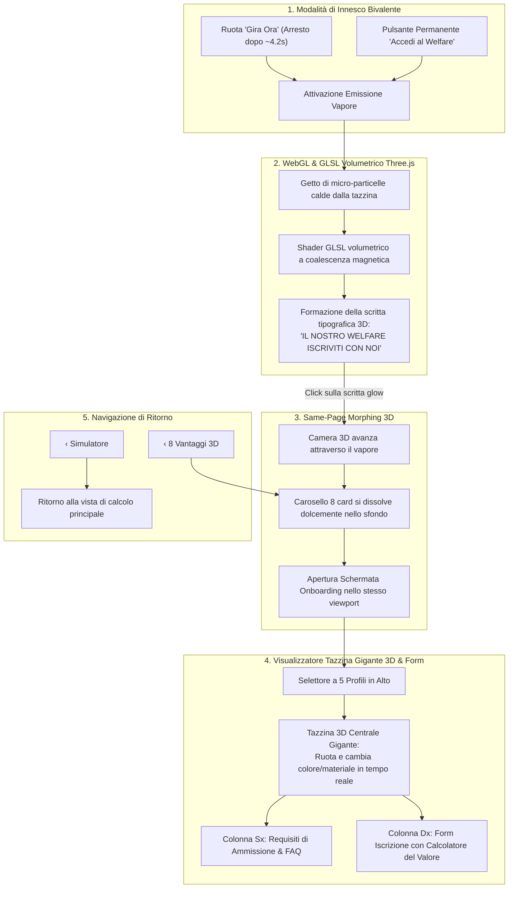

# ☕ Piano Esecutivo & Architettura Finale: Welfare Onboarding 3D Experience

> **Stato**: Approvato all'unanimità tramite sessione `/grill-me`.  
> **Obiettivo**: Implementare la sequenza immersiva completa dal trigger della ruota e pulsante rapido fino alla transizione volumetrica e al portale di onboarding con Tazzina 3D Gigante ad assetto dinamico.

---

## 1. Architettura delle Decisioni Condivise (`/grill-me` Consensus)

---

## 2. Specifiche Tecniche per Modulo

### 2.1 Modulo Fumo Tipografico (Three.js & Custom GLSL Shader)
- **Canvas Overlay**: Inserito come `<canvas id="smokeCanvas">` con coordinate allineate alla tazzina attiva.
- **Shader Pipeline**:
  - `vertexShader`: Applica una funzione di turbolenza Simplex Noise 3D dipendente dal tempo $t$ e dalla distanza dall'origine.
  - `fragmentShader`: Calcola l'attenuazione radiale della densità del vapore con colore dinamico bianco-azzurro semitrasparente (`rgba(224, 242, 254, alpha)`).
- **Target Point Cloud**:
  - Un set di coordinate 2D/3D generate rasterizzando la scritta in memoria su un canvas virtuale offscreen con font bold (`Inter` o `JetBrains Mono`).
  - All'istante $t = 2.5s$, la forza attrattiva porta le particelle a posizionarsi sui pixel del testo, stabilizzando la scritta per la lettura.
- **Interattività**:
  - Al mousemove, raggio di respingimento locale di 40px che disturba il vapore facendolo poi ritornare in sede.
  - Al clic, scatta la funzione `enterWelfareOnboarding()`.

### 2.2 Modulo Tazzina 3D Gigante Centrale (Morphing Cromatico)
Geometria 3D creata con Three.js (`CylinderGeometry` conico smussato + `TorusGeometry` per il manico + `CircleGeometry` per la superficie del caffè):
- **Materiale Liquid Glass Dinamico**: `MeshPhysicalMaterial` con `roughness: 0.15`, `transmission: 0.72`, `thickness: 1.2`, `ior: 1.45`.
- **Palette Cromatica per Profilo**:
  1. 🏢 **Grandi Imprese / HR**: Zaffiro Profondo (`#2563eb`), riflessi metallici, luce blu fredda.
  2. 👥 **Addetti Imprese Clienti**: Azzurro Cristallo Ghiaccio (`#0ea5e9`), bagliori ciano luminosi.
  3. 🌾 **Produttori Agricoli a Km 0**: Smeraldo Bio (`#059669`), riflessi dorati e caldi.
  4. 🏨 **Hotel, Agriturismi & Ristoranti**: Ambra Terracotta (`#d97706`), bagliori ambrati e toni miele.
  5. 🎭 **Cultura, Spettacoli & Eventi**: Ametista Notturna (`#7c3aed`), diffrazione porpora e violetto.
- **Animazione di Cambio Profilo**: Quando l'utente clicca su un profilo, la tazzina compie una rotazione di 360° sull'asse Y con interpolazione di colore lineare (`material.color.lerp(...)` in 500ms).

### 2.3 Calcolatore Istantaneo del Valore nel Form
Ogni scheda di iscrizione non è un form statico, ma un micro-simulatore reattivo:
- **Impresa**: Slider `Addetti in Azienda` (es. 50) $\rightarrow$ Calcola: *€ 3.750 Welfare deducibile 100% ex TUIR art. 51 + -80% Churn fornitore*.
- **Addetto**: Calcola: *€ 75 benefit netto annuo (hotel + food) + 1 biglietto spettacolo omaggio (€25) + consegna spesa a km 0 sul posto di lavoro*.
- **Produttore Km 0**: Slider `Panieri Settimanali Stimati` (es. 20) $\rightarrow$ Calcola: *€ 28.800 fatturato annuo diretto + € 4.560 tratte logistiche risparmiate (0 km dedicati)*.
- **Hotel / Ristorante**: Slider `Posti / Camere Convenzionate` $\rightarrow$ Calcola: *€ 12.500 fatturato stimato senza commissioni OTA + indotto turistico 2.5×*.
- **Cultura / Eventi**: Mostra: *2.250 presenze dirette finanziate dal fondo Matching Grant Startup (€ 56.250)*.

### 2.4 FAQ & Requisiti Istituzionali
- Requisiti conformi alla normativa vigente (nessun costo di iscrizione, fornitura gratuita della piattaforma di gestione voucher, pagina web promozionale per ciascuna impresa partecipante).
- Accordion a espansione fluida con tipografia chiara ad alto contrasto.

---

## 3. Piano Operativo di Sviluppo

| Step | Attività | File Coinvolti |
| :---: | :--- | :--- |
| **1** | Inclusione Three.js e creazione del motore shader del fumo per la scritta tipografica | `asset/landing-page-3d-vetro.html` |
| **2** | Aggiunta del pulsante permanente *"Accedi al Welfare"* e aggancio al trigger *"Gira Ora"* | `asset/landing-page-3d-vetro.html` |
| **3** | Implementazione della transizione Same-Page Morphing della camera | `asset/landing-page-3d-vetro.html` |
| **4** | Creazione della vista Onboarding con Tazzina Gigante 3D e selettore cromatico a 5 profili | `asset/landing-page-3d-vetro.html` / `public/` |
| **5** | Integrazione dei Requisiti, FAQ e del Form con Calcolatore Istantaneo del Valore | `asset/landing-page-3d-vetro.html` |
| **6** | Allineamento delle copie in `public/` e verifica TypeScript/Vite con `npm run build` | `public/`, `src/App.tsx` |
| **7** | Test visivo interattivo in browser con registrazione WebP | Browser Subagent |
